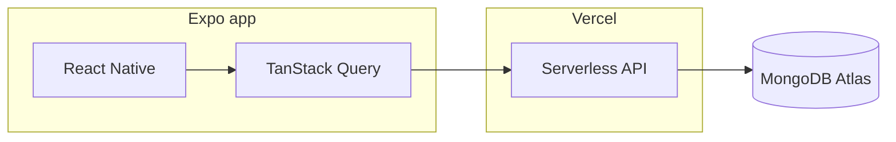

# Matchpoint

Beach volleyball tournament app for **Android** (Play Store). Organizers create invite-only tournaments; players join via links, form **2-person teams**, and manage entries. Includes **Google**, **Apple**, and **email** authentication.

**By [Miralab](https://miralab.ar)**

[](https://github.com/octapf/matchpoint/actions/workflows/ci.yml)

---

## Who this documentation is for

| Audience | What to read first |
|----------|-------------------|
| **Recruiters / hiring managers** | This README: problem, stack, and that CI is green. |
| **Engineers cloning the repo** | [docs/SETUP.md](docs/SETUP.md), then [docs/EXPO_AND_VERCEL.md](docs/EXPO_AND_VERCEL.md) if anything fails. |

**Portfolio tip:** A strong public repo shows a **clear product sentence**, **runnable steps**, **automated checks**, and **honest docs**. Depth lives in `docs/` so the README stays scannable.

---

## Problem and approach

Tournament organizers need a simple way to run **invite-only** beach volleyball events: share a link, cap teams, and track who joined and who is **looking for a partner**. Matchpoint keeps that flow on mobile with a small Vercel + MongoDB backend.

---

## Features (high level)

- Tournaments with date range, capacity, status, and **organizer** roles  
- **Invite links** (`/t/{token}`) with web fallback where configured  
- **Entries** and **teams** (2 players)  
- **i18n:** English, Spanish, Italian  

---

## Architecture



| Layer | Stack |
|-------|--------|
| **Mobile** | Expo 55, React Native, Expo Router, NativeWind |
| **State** | Zustand, TanStack Query |
| **Auth** | Google, Apple, email (JWT + verification flows on API) |
| **Backend** | Vercel serverless (`api/`) |
| **Database** | MongoDB (`matchpoint` DB) |

**Why these choices:** short ADR — [docs/adr/001-stack-and-hosting.md](docs/adr/001-stack-and-hosting.md).

---

## Prerequisites

- Node.js **18+** (CI uses **20**)
- npm
- [Expo / EAS](https://docs.expo.dev/) for builds
- MongoDB Atlas + Vercel for the API
- Google (and Apple for iOS) OAuth setup as in [docs/SECRETS.md](docs/SECRETS.md)

---

## Quick start

```bash
git clone https://github.com/octapf/matchpoint.git
cd matchpoint
npm install
cp .env.example .env   # fill EXPO_PUBLIC_* — see docs/SECRETS.md
npm run verify
npm run start
```

**Full setup** (API, device, builds): **[docs/SETUP.md](docs/SETUP.md)**.

---

## Scripts

| Command | Description |
|---------|-------------|
| `npm run start` | Expo dev server |
| `npm run start:tunnel` | Dev server with tunnel |
| `npm run android` | `expo run:android` |
| `npm run ios` | `expo run:ios` |
| `npm run web` | Web |
| `npm run api:dev` | Vercel dev for `/api` |
| `npm run typecheck` | `tsc --noEmit` |
| `npm run verify` | Same as CI (typecheck) |

---

## Documentation map

| Doc | Content |
|-----|---------|
| [docs/README.md](docs/README.md) | Index of all guides |
| [docs/SETUP.md](docs/SETUP.md) | Install, env, run, EAS |
| [docs/SECRETS.md](docs/SECRETS.md) | Env vars (no secret values) |
| [docs/EXPO_AND_VERCEL.md](docs/EXPO_AND_VERCEL.md) | Expo Go vs dev build, API URL |
| [docs/MAINTENANCE.md](docs/MAINTENANCE.md) | When to update docs |
| [CONTRIBUTING.md](CONTRIBUTING.md) | PRs and local verify |
| [VERCEL_DEPLOY.md](VERCEL_DEPLOY.md) | Deploy API |
| [MONGODB_SETUP.md](MONGODB_SETUP.md) | Atlas |
| [DOMAIN_SETUP.md](DOMAIN_SETUP.md) | Domain / app links |
| [CONNECT-DEVICE.md](CONNECT-DEVICE.md) | USB / tunnel / `expo run:android` |

---

## Building and release

EAS profiles are in `eas.json`. Example:

```bash
npx eas build --profile development --platform android
```

Play submission uses a **service account JSON** path in `eas.json`; keep that file under `./credentials/` (gitignored). See [credentials/README.md](credentials/README.md).

---

## License

Private — Miralab.
